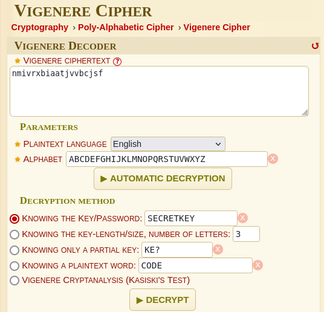

# Vinegar

## Description

Can you decode this message? Note: Wrap the decrypted text in n00bz{}.

## Attachments

[enc.txt](attachments/enc.txt)

## Solution

- The title of this challenge seems to hint toward the
[Vigenère cipher](https://en.wikipedia.org/wiki/Vigen%C3%A8re_cipher). In short, this
cipher encrypts the plaintext by applying different
[Caesar ciphers](https://en.wikipedia.org/wiki/Caesar_cipher) to each character according
to a key.

- We are given both the encrypted message and the key in the attachment. I used
[dcode.fr](https://www.dcode.fr/vigenere-cipher) and provided the given information
to decrypt the message:

- The plaintext was "vigenerecipherisfun," which is the flag.

## Flag

n00bz{vigenerecipherisfun}
