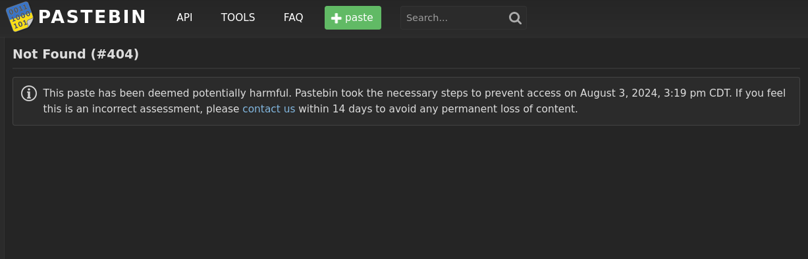
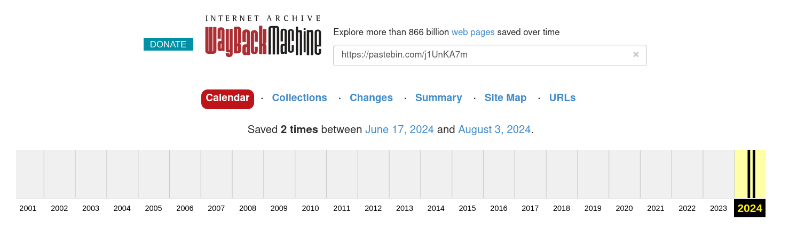

# Pastebin

## Description

Just go to my pastebin which was created long time back.

**Important!**

There have been some changes to this challenge due things outside our control. The above description
is still valid (and so is the note), but you will need the new info to solve the challenge now.

Note:- https://pastebin.com/u/abhinav654321

New info:- https://pastebin.com/j1UnKA7m

## Solution

- I started by following the "New info" link (https://pastebin.com/j1UnKA7m). That page looked like
this:

- It seems like the content here was removed recently, so I decided to try using the
[Wayback Machine](https://web.archive.org/). This is an archiving tool that can be used to potentially
find older versions of websites. I pasted the "New info" link into the Wayback Machine, which
revealed that a snapshot of this page had been taken on June 17, 2024.

- If we access the June version of the website
(https://web.archive.org/web/20240617125911/https://pastebin.com/j1UnKA7m), we can see the flag
in plaintext.

## Flag

n00bz{l0ng_t1m3_ag0_m34ns_w4yb4ck}
