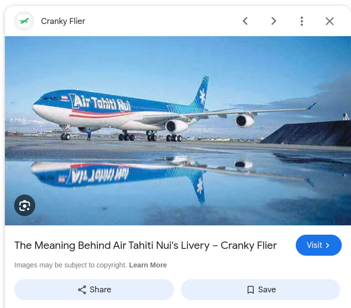

# Tail

## Description

Here's a picture of a plane's tail. Can you find the airline's hub (the airport where they mostly
operate from). Use the three letter airport IATA code and wrap it in n00bz{}. Example: n00bz{SFO}.

## Attachments

[tail.jpg](attachments/tail.jpg)

## Solution

- I went to Google Images and searched for what I saw in the provided image: "airline tail
white flower." After briefly scrolling through the results, I came across this image that
identified the airline as Air Tahiti Nui.

- I went to Air Tahiti Nui's [Wikipedia page](https://en.wikipedia.org/wiki/Air_Tahiti_Nui),
which also linked to the article on this airline's hub,
[Faaʻa International Airport](https://en.wikipedia.org/wiki/Faa%CA%BBa_International_Airport). The
IATA code of this airport can be found on this Wikipedia page.

## Flag

n00bz{PPT}
