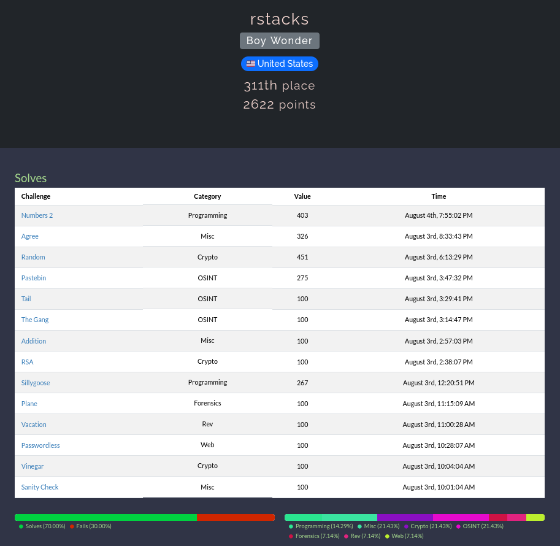

# n00bzCTF 2024 Writeup

[n00bzCTF 2024](https://ctf.n00bzunit3d.xyz/) was a 48 hour competition that ran from 8/2/2024 through 8/4/2024. Below are my writeups for the challenges I
completed. You can also see my results in the competition below.

Click [here](https://github.com/rstacks/ctf-writeups) to check out my writeups for other CTFs I've participated in.

## Solved Challenges 

  
Crypto

  * [RSA](Crypto/RSA)
  * [Random](Crypto/Random)
  * [Vinegar](Crypto/Vinegar)
  

  
Forensics

  * [Plane](Forensics/Plane)
  

  
Misc

  * [Addition](Misc/Addition)
  * [Agree](Misc/Agree)
  

  
OSINT

  * [Pastebin](OSINT/Pastebin)
  * [Tail](OSINT/Tail)
  * [The Gang](OSINT/TheGang)

  
Programming

  * [Numbers 2](Programming/Numbers2)
  * [Sillygoose](Programming/Sillygoose)

  
Rev

  * [Vacation](Rev/Vacation)
  

  
Web

  * [Passwordless](Web/Passwordless)

## Results

I was the sole member of team Boy Wonder. I scored **2622** points in total and finished **311th out of 967** teams (that solved at least one challenge).

*Writeup for the "Sanity Check" challenge not included.
